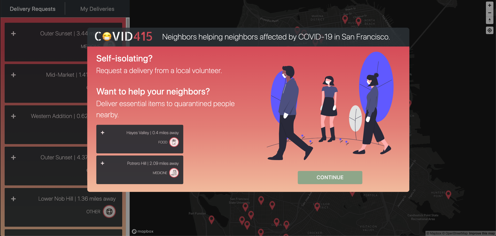

# COVID415


###### [Live Site](http://covid415.herokuapp.com/#)

## Table of Contents

* [Creators](#creators)
* [Background](#background)
* [Technologies](#technologies)
* [Features](#features)
* [Code Snippets](#code-snippets)

---

## Creators

###### [Jump to Background](#background)

* [Andrew Howell](https://www.linkedin.com/in/andrewhhowell/)
* [Justin Fang](https://www.linkedin.com/in/justinjfang/)
* [Tarik Gul](https://www.linkedin.com/in/tarik-gul-6497b21a4/)
* [Zeke Mostov](https://www.linkedin.com/in/zeke-mostov-62557620/)

---

## Background
###### [Jump to Technologies](#technologies)


__tl;dr__  [COVID415](http://covid415.herokuapp.com/#/) is a service that matches San Franciscans in self-isolation due to the novel coronavirus 2019-nCoV (also known as COVID-19) pandemic with local volunteers to deliver essentials like food and medicine.
###### [Jump to Interface Themes](#interfac-themes)




#### Interface Themes

The site affords users the ability to both post a request for help from a volunteer, as well as volunteer to help themselves. Volunteers can take on delivery requests (which are conveniently sorted by distance away), view their pending delivery requests, and confirm they have carried out the delivery.

Visually, the App is centered around a map and a red, yellow, green color theme. Features related to different stages of task completion embrace this intuitive color scheme to relay a sense of urgency for yet to be claimed/completed tasks and provide a feeling of accomplishment for completed tasks. For example, red markers indicate tasks that have yet to have a volunteer take them on, yellow markers are pending tasks, and green markers indicate tasks that have been completed. Yellow and green markers are only visible to the logged in volunteer and reference their task portfolio.

---

### Technologies

* Front-end:
  * React
  * Redux
  * Axios
* Back-end
  * Express
  * MongoDB
  * JWT
  * Passport
* Cloud:
  * Heroku
* Integrations:
  * Google Maps Geoencoding API
  * Google Maps Distance Matrix API
  * MapBox

---

### Features

#### View delivery requests

###### [Jump to Next Feature Highlight](#manage-your-deliveries)
_An interactive list and map show all delivery requests sorted by distance away. Users can browse requests and accept a request._


#### Manage your deliveries

###### [Jump to Next Feature Highlight](#request-a-delivery)
_A separate tab allows users to view and manage all the delivery requests that they've accepted._


#### Request a delivery 

###### [Jump to Future Features ](#future-features)
_As a user under self-isolation, you can request a delivery which will be added to the list and map._


#### Future features

* Direct messaging
* Notifications
* Secure payment integrations

---

## Code Snipets

### Backend Google Maps API Geocoding

###### [Jump to Next Code Snippet](#frontend-mapbox-api-popups)

Using express we made calls to various Google Maps API's in order to facilitate:

1. Autocomplete Address Search

2. Address formatting for incomplete / mal-formed address input

3. Tagging of neighborhood data against request addresses

4. Geoencoding of address' Latitude and Longitude

``` javascript
// routes/api/tasks.js
router.post('/',
  passport.authenticate('jwt', { session: false }),
  (req, res) => {
    const { errors, isValid } = validateTaskInput(req.body);
    if (!isValid) {
      return res.status(400).json(errors);
    }
    const unFrozenParser = backendUtil.pullKeys(req.user);

    // Connecting to Google's Geocoding API, and receiving an origins Latitude,
    // and Longitude along with their address. This is used in conjuction with
    // Google's address autocomplete library and API in order to help the user
    // provide valid street addresses
    geocodeUtil.parseAddress(req.body.deliveryAddress).then(
      (gMapsResponse) => {
        const newTask = new Task({
          type: req.body.type,
          details: req.body.details,
          requester: unFrozenParser,
          deliveryAddress: gMapsResponse.data.results[0].formatted_address,
          deliveryLatLong: 
            Object.values(gMapsResponse.data.results[0].geometry.location),
          deliveryNeighborhood: 
            gMapsResponse.data.results[0].address_components[2].short_name,
          deliveryInstructions: req.body.deliveryInstructions,
        });
        newTask.save()
          .then((task) => res.json(task))
          .catch(err => res.json(err))
      },
    )
      .catch(err => res.json(err));
});
```

### MapBox Marker Popups

###### [Jump to Next Code Snippet](#toggling-mapbox-markers-based-on-sidebar-tab)

In order to display markers on the map and show popups for each marker on hover of the marker or the associated task card in the left sidebar, we utilized the MapBox Marker and associated Popup API. The markers and popups are then styled to communicate their respective status in a task's lifecycle (i.e., unmatched->pending delivery->completed).

To accomplish the cross component communication, we have a slice of state that reflects the current task that is being hovered over in the sidebar.

``` javascript
// frontend/components/map/map.jsx
geojson.features.forEach((marker) => {

      // Create a HTML element for each feature
      const el = document.createElement('div');
      const { status, type } = marker.properties
      if (status === 0) {
        el.className = 'marker notActive'
      } else if (status === 1) {
        el.className = 'marker active'
      } else if (status === 2) {
        el.className = 'marker completed'
      }
      const popup = new mapboxgl.Popup({
        offset: 25,
        closeButton: false,
        closeOnClick: false,
        className: statusPopupClass(status)
      }).setHTML(
        `${type} delivery${`<br />`}${typeIconString(type.toLowerCase(), status)}`
      )

      // Make a marker for each feature and add to the map
      const mapBoxMarker = new mapboxgl.Marker(el)
        .setLngLat(marker.geometry.coordinates)
        .setPopup(popup)

      // Add mapBox marker and associated id to array
      allMarkers.push({ mBMarker: mapBoxMarker, id: marker.properties.taskId });

      // Get HTML element of marker and attach an event listener so we can
      // detect when a mouse enters or leaves
      const markerEl = mapBoxMarker.getElement();
      markerEl.addEventListener('mouseenter', () => {

        // Add popup to map
        popup.addTo(map);
      });
      markerEl.addEventListener('mouseleave', () => {

        // Remove popup from map
        popup.remove();
      });
    });

    // updatePopuups() is called on each render. It grabs activeTask, which
    // is a task id stored in global state that changes based upon what task
    // is being hovered over in the sidebar component.
    updatePopups() {
    const { userMarkers, helpNeededMarkers, map } = this.state;
    const { activeTask } = this.props;

    // Check that all the markers exist before trying to use them
    if (!(userMarkers && helpNeededMarkers)) return;

    // Combine marker array so we can loop over them in one go. This helps with
    // edge cases.
    const allMarkers = userMarkers.concat(helpNeededMarkers);
    allMarkers.length && allMarkers.forEach((markerObj) => {

      // We store an object tuple that has both the Map Box marker and the id of
      // its task.
      const { mBMarker, id } = markerObj;

      // If we find the relevant marker and it is not open, open it by adding 
      // the popup to the map
      if (
        activeTask && activeTask.taskId === id && !mBMarker.getPopup().isOpen()
      ) {
        mBMarker.getPopup().addTo(map)
      } else if (mBMarker.getPopup().isOpen()) {
        mBMarker.getPopup().remove();
      }
    })
  }
```

### Toggling MapBox Markers Based On SideBar Tab

###### [Jump to Next Code Snippet](#sorting-distances)

##### Overview

When a user toggles between the "Delivery Requests" and "My Deliveries" tabs the markers on the map change to reflect what tasks are displayed on the sidebar.

##### Flow:

* On componentDidMount() and when tasks change - map the users tasks and available tasks to two sperate arrays of MapBox markers that are stored in component state.
* Add the markers associated with the current tab to the map based on a boolean in global store that indicates the sidebar tab.
* When the user clicks to change the tab, update a boolean field in global store from the sidebar component.
* The map has the active tab slice of state mapped in. In ```componentDidUpdate()``` we check if this slice of state changes and when it does we remove the relevant markers from the map and add the other markers to the map.
* Upon the dete

```javascript
// frontend/src/components/map/map.jsx

// When the component mounts, set up the map box map with navigation and bounds
// centered around the bay area
componentDidMount() {
    mapboxgl.accessToken = mapBoxPublicKey;

    // Set the map's max bounds
    const bounds = [
      [-122.54, 37.6], // [west, south]
      [-122.34, 37.9]  // [east, north]
    ];
    const map = new mapboxgl.Map({
      container: this.mapContainer,
      style: 'mapbox://styles/mapbox/dark-v10',
      center: [this.state.lng, this.state.lat],
      zoom: this.state.zoom
    });
    map.addControl(new mapboxgl.NavigationControl());
    map.addControl(
      new mapboxgl.GeolocateControl({
        positionOptions: {
          enableHighAccuracy: true
        },
        trackUserLocation: true
      })
    );
    map.setMaxBounds(bounds);
    this.setState({
      map,
      dispalyNotAssignedTasks: this.props.dispalyNotAssignedTasks
    });

    // Call placeMarkers() to do initial marker generation for both the users
    // allocated tasks, and task that have not been uptaken
    // N.B. the full function is shown in the popups code snippet section
    this.callPlaceMarkers();
  }

  // Recursively sets a timeout and calls itself if not loaded -essentially a 
  // recursive while loop
  callPlaceMarkers() {

    // Before generating markers, check if the map has been setup and if the.
    // tasks exist.
    if (this.state.map && this.props.tasks.length) {

      // Generate map markers and then save them to state. Note that the
      // placeMapMarkers() function name is a misnomer as it just generates the
      // markers with popups and does not actually place them on the map.
      const userMarkers = this.placeMapMarkers(this.props.currentUserTasks);
      const helpNeededMarkers = this.placeMapMarkers(this.props.helpNeededTasks);
      this.setState({ userMarkers, helpNeededMarkers })
    } else {

      // If the the map or tasks do no exist yet, check again 1/10th of a second
      setTimeout(() => {
        this.callPlaceMarkers()
      }, 1 * 100)
    }
  }

  // When the component updates, we check if there are new tasks. If there are 
  // new tasks we recreate all the markers
  componentDidUpdate(prevProps) {

    // Make sure to compare props to prevent infinite loop. We check for
    // a change in the number of tasks as it prevents from false positives
    // that might result from different ordering so the tasks mapped in.
    if (Object.keys(this.props.tasks).length !== Object.keys(prevProps.tasks).length) {

      // Clear all markers from map
      this.clearMarkers(this.state.userMarkers);
      this.clearMarkers(this.state.helpNeededMarkers);

      // Generate new markers and save to state
      const userMarkers = this.placeMapMarkers(this.props.currentUserTasks);
      const helpNeededMarkers = this.placeMapMarkers(this.props.helpNeededTasks);
      this.setState({ userMarkers, helpNeededMarkers })
  }

  // updateMarkers() is called in the maps render method and replaces the
  // relevant markers based on the slice of state that indicates which tab is
  // open in the sidebar.
  updateMarkers() {
    const { userMarkers, helpNeededMarkers } = this.state;
    if (this.props.dispalyNotAssignedTasks) {
      this.clearMarkers(userMarkers);
      this.addMarkers(helpNeededMarkers);
    } else {
      this.clearMarkers(helpNeededMarkers);
      this.addMarkers(userMarkers);
    }
  }

  // Removes each marker in the passed in array from the map
  clearMarkers(markers) {
    if (!markers) return;
    markers.forEach((marker) => {
      marker.mBMarker.remove();
    })
  }

   // Adds each marker in the passed in array from the map
  addMarkers(markers) {
    if (!markers) return;
    markers.forEach((marker) => {
      marker.mBMarker.addTo(this.state.map);
    })
  }


```

### Sorting Distances

##### Overview

In order to motivate task uptake and completion by volunters, tasks are sorted by their relative distance to the current user.

##### Current implementation flow:

* Wait for current user location.
* Once user location is received dispatch to state.
* When a change in user location is detected in componentDidUpdate calculate distance from user for each task and dispatch each task with updated distance to state
* Upon tasks receiving a non-null distance attribute, trigger a sort of tasks by location

##### Bottleknecks & Future improvements:

  At the moment all of the above flow takes place within react components. Therefore, the execution of each step is dependent on components mounting, and updating, and in some cases, rendering. For example, we trigger tasks sorts in the render method of each sidebar tab.

  To improve this in future, we plan on decoupling user location, task distance calculations, and task sorting from the components. Specifically, we plan to have an array in state of task ids that will hold order. Upon recieving a non-null user location, distance calculations for each task will be triggered. When a task with an updated distance is dispatched, a check for the ability to sort the task id array will be triggered. When the number of tasks with a non-null distance field reaches an arbitrary threshold the valid tasks will be sorted and tasks without distance put at the end of the array. Components rendering ordered tasks can simply reffer to the task id array in state.

  There likely would be siginificant performance benefits on the client, as sorting and distance calculations only take place once, instead of being arbitrarly triggered during a components life cycle.

##### Code

In order to grab the current users position, we used the built-in ```navigator.geolocation.getCurrentPosition()```.

``` javascript
// frontend/actions/location_actions.js
export const getUserLocation = () => (dispatch) => {
  navigator.geolocation.getCurrentPosition((pos) => {
    return  dispatch(receiveUserLocation(pos))
  }
)};
```

We wait for our results within a ```componentDidUpdate``` lifecycle method. While waiting asychronously for our results we present a loading icon. Once the results are received, we calculate the distance for each task using difference in Lat/Long via the turf.js library. We then add it to the task object, and dispatch the updated task to global store.

``` javascript
// frontend/components/sidebar/card.jsx
distanceFromCurrentToTask() {
    const { task, currentPosition } = this.props
    if (this.props.task === undefined) {
      return null
    }
    if (currentPosition.length === 0) {
      return null
    }
    const {latitude, longitude} = currentPosition.coords;
    const from = turf.point([longitude, latitude])
    const to = turf.point([task.deliveryLatLong[1], task.deliveryLatLong[0]])
    const options = { units: 'miles' }
    const distanceTo = turf.distance(from, to, options)
    const dist = frontendUtil.parseDistance(distanceTo)
    task['distance'] = dist
    this.props.receiveNewTask(task)
  }
 ```

Next, we send our information to a reducer, which makes sure to maintain a tasks distance attribute even when recieving updated tasks from the database which do not have a distance field.

``` javascript
//fronend/reducers/task_reducer.js
const convertToTasksObj = (tasks) => {
  const newTasks = {};
  tasks.forEach((t) => {
    newTasks[t._id] = t;
  })
  return newTasks;
}

const allTasksUpdate = (tasks, nextState) => {
  tasks.forEach((t) => {
    if (nextState[t._id] !== undefined) {
      // call function that replaces updated fields
      const updated = {
        ...nextState[t._id],
        ...t
      }
      nextState[t._id] = updated
    } else {
      nextState[t._id] = t
    }
  })
  return nextState;
}

const TasksReducer = (state = {}, action) => {
  Object.freeze(state)
  let nextState = Object.assign({}, state)
  switch (action.type) {
    case RECEIVE_TASKS:
      if (Object.keys(nextState).length > 0) {
        nextState = allTasksUpdate(action.tasks.data, nextState);
      } else {
        nextState = convertToTasksObj(action.tasks.data)
      }
      return nextState
    case RECEIVE_NEW_TASK:
      if (nextState[action.task._id] !== undefined) {
        const updated = {
          ...nextState[action.task._id],
          ...action.task
        }
        nextState[action.task._id] = updated
      } else {
        nextState[action.task._id] = action.task.data
      }
      return nextState
    default:
      return state
  }
}
```
